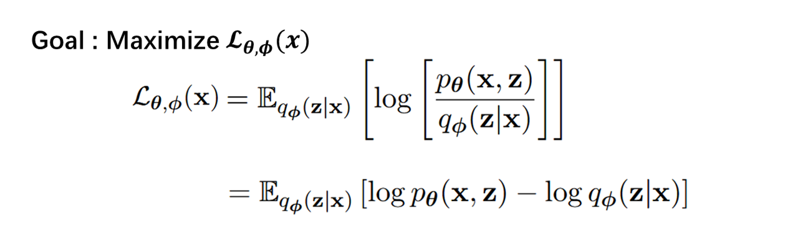
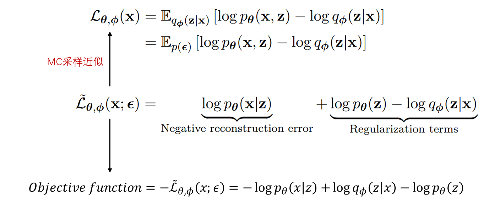
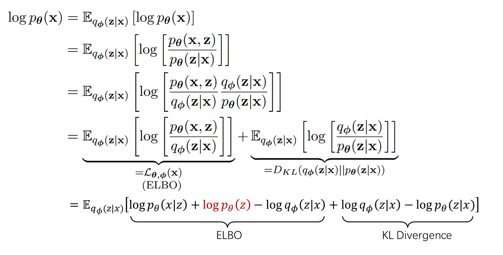
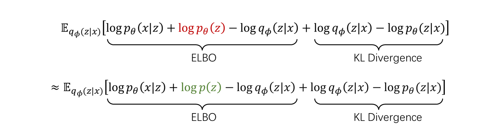

记录学习和理解VAE模型过程中的一点思考。

## 1. Probabilistic Model

**什么是概率模型**

根据维基百科的定义，概率模型是用来描述不同随机变量之间关系的数学模型，通常情况下刻画了一个或多个随机变量之间的相互非确定性的概率关系。从数学上讲，该模型通常被表达为$(X,P)$，其中$X$是观测集合用来描述可能的观测结果，$P$是$X$对应的概率分布函数集合。**简单来说就是概率模型将观测样本看作随机变量**，并对每个随机变量赋予概率分布。

**概率模型的目标**

在概率模型中，我们经常通过最大似然的方法来对模型中的各项参数进行估计。所谓最大似然，就是通过对观测样本$x$进行概率建模$p_\theta(x)$，并让所有观测样本的发生概率$L = \prod_{i=1}^{N} p_\theta(x_i)$最大，其中$L$即为似然函数，最大化$L$的过程就是最大似然 。通过最大似然我们可以对$p_\theta(x)$的参数$\theta$进行估计，得到的便是最大似然估计$\hat{\theta}$。然而现实中我们观测到的数据及其概率分布往往比较复杂，这时候如果用一个简单的分布来对其进行建模，那么即便能够通过让偏导数为0这种方式写出各项参数最大似然估计的解析解，但是显然建模效果会比较差。这就迫使我们去寻找一些复杂的分布进行建模，但使用复杂分布的问题在于，我们不再能通过简单的求偏导的方式写出参数估计的解析解，EM算法就是为了解决这类问题而产生的。

## 2. Expectation Maximization（EM）

**引入隐变量**

具体来说，我们用$p_\theta(x)$代表数据的分布，这里$p_\theta(x)$是对概率密度函数（连续情况）或概率质量函数（离散情况）的一个数学表示，它可以代表任何复杂的分布，其中$\theta$代表函数中的参数，通常这个$\theta$就是我们想要优化或者估计的变量。在最大似然估计中，我们通常令$\nabla_\theta{\log L}=0 , L = \prod_{i=1}^{N} p_\theta(x_i)$从而解方程得到$\theta$最大似然估计值$\hat{\theta}$。然而当$p_\theta(x)$的形式比较复杂时，是无法直接解方程写出最大似然估计的解析解的，EM考虑用迭代的方法来求解$\theta$。首先对问题进行一下转换，当$p_\theta(x)$比较复杂的时候我们尝试引入隐变量$z$（这里要接受一个事实，很多时候增加变量反而会使问题变得简单，或许可以理解为原本分布复杂是因为多种分布耦合在一起，增加变量起到了解耦的作用），那么可以对$\log p_\theta(x)$做如下恒等变形：

**ELBO和KL Divergence**

注意上述等式推导与分布的具体形式无关，在任何情况下都是成立的，另外很多参考资料也将上述推导写为积分形式，这里我们参考VAE原作者Diederik P. Kingma所著*An Introduction to  Variational Autoencoders*，将推导写为期望形式，两种形式完全相同。可以看到，通过引入隐变量我们将 $\log p_\theta(x)$ 写成了 $L_{\theta,\phi}(x)$（Evidence Lower Bound）+ $D_{KL}$（KL Divergence）的形式，其中 $q_\phi(z\vert x)$ 是引入隐变量的后验分布，它是对隐变量的真实后验分布 $p_\theta(z \vert x)$ 的近似（这里所说的隐变量的真实后验分布，并不是说真实世界里存在一个这样的隐变量服从$p_\theta(z|x)$，而是说基于我们的模型$p_\theta(x)$所推导出的隐变量$z$所应该服从的后验分布，但这个分布仍然难以求得，因此用$q_\phi(z|x)$来近似），当近似的后验分布等于真值即 $q_\phi(z\vert x) = p_\theta(z\vert x)$ 时，表明引入隐变量的后验分布与隐变量的真实后验分布完全相同，此时 $D_{KL}=0, \log p_\theta(x)=L_{\theta,\phi}(x)$。

这里对这种拆解形式做一点简单的说明，首先来看 $ p_\theta(x)$ ，我们一般称之为Evidence或者Marginal Likelihood，前面已经说过它是对观测样本概率分布的数学表示，我们可以简单将其理解为观测样本 $x$ 发生的 概率。$D_{KL}$ 作为一个KL Divergence用于衡量两个分布之间的差异，是恒大于0的，故必有 $L_{\theta,\phi}(x) \leq \log p_\theta(x)$ ，因此我们称 $L_{\theta,\phi}(x)$ 为 $\log p_\theta(x)$ 的一个Evidence Lower Bound (ELBO)。**实际上，固定 $\theta$ 的情况下 $\log p_\theta(x)$ 保持不变，这时候 $L_{\theta,\phi}(x)$ 和 $D_{KL}$ 就是 $\log p_\theta(x)$ 这一枚硬币的两个面，他们都表达了近似后验分布 $q_\phi(z \vert x)$ 与真实后验分布 $p_\theta(z \vert x)$ 之间的差异， $q_\phi(z \vert x)$ 越接近 $p_\theta(z \vert x)$ ，ELBO越接近Evidence，KL divergence越趋向0。**

**从Maximize Likelihood到Maximize ELBO**

由于我们已经推导出了 $\log p_\theta(x)$ 的下界 $L_{\theta,\phi(x)}$ ，因此最大化 $\log p_\theta(x)$ 的任务就可以转换成最大化 $L_{\theta,\phi}(x)$ 问题。

> 尽管大多数参考资料中不加解释的提出了这个问题的转换形式，但我觉得这里并不是直观到可以不言自明的，因此额外做一点解释：最大化$\log p_\theta(x)$要优化参数$\theta$，而最大化$L_{\theta,\phi}(x)$既要优化$\theta$又要优化$\phi$，为什么这两个问题会等价呢？我们可以这样简单理解，优化$\phi$可以单独让$L_{\theta,\phi}(x)$变大，但只要$\theta$固定，$L_{\theta,\phi}(x)$就不会超过$\log p_\theta(x)$。而优化$\theta$可以让两者同时变大，因此实际上是参数$\theta$同时决定了两者的上界，最大化的问题是去找上界，因此两个问题等价。

接下来的问题是如何最大化 $L_{\theta,\phi}(x)$ 呢？或者说如何优化 $\theta$ 和 $\phi$ 呢？EM给出的解决方案是使用迭代的方法分步优化 $\theta$ 和 $\phi$ 。1）固定 $\theta$ ，也就是固定 $\log p_\theta(x)$ ，优化 $\phi$ 让 $ L_{\theta,\phi}(x)$ 增大至 $\log p_\theta(x)$ ；2）固定 $\phi$ ，优化 $\theta$ 让 $L_{\theta, \phi}(x)$ 最大，此时 $\log p_\theta(x)$ 会再次超过 $L_{\theta, \phi}(x)$ ，于是回到第一步。可以看到整个过程中都在Maximize ELBO，让两步反复进行直至收敛，就得到了 $\theta$ 的最大似然估计，这就是EM算法。

## 3. Posterior Approximation

**从最大化ELBO到寻找潜变量$z$的近似后验分布**

在EM算法的E步，我们通过优化$\phi$来让潜变量的近似后验分布等于真实后验分布即 $q_\phi(z\vert x) = q_\theta(z\vert x)$ ，然而实际上想要直接写出这个潜变量$z$的真实后验分布的解析解往往是很困难的，这时就需要用一些方法来让近似后验尽可能的接近真实后验即 $q_\phi(z\vert x) \approx q_\theta(z\vert x)$ （很多概率模型的变体就是针对这里的近似方法进行调整）。寻找近似后验分布的方法有很多，根据PRML书中的说法，大体上可以分为两类，一类是基于随机采样的近似方法（Stochastic approximation），如MCMC；一类是确定性的近似方法（Deterministic approximation），如变分推断(Variational Inference)，这里为了后面引入VAE我们简要介绍一下第二类近似方法。

当我们使用Deterministic approximation的方法时，首先需要对真实后验分布做出一些假设以方便计算，如常见的变分推断（Variational Inference）所使用的Mean field theory假设 $q(z) = \prod_{i=1}^{M}q_i(z_i)$ 。这里要注意的是，假设本质上是一种约束条件，我们增加这些约束条件的目的仅仅是为了方便得到优化结果的解析解，因此在使用假设的时候，应该在方便计算的前提下尽可能去选择更为宽松灵活的假设条件。所谓变分（Variational），就是通过假设条件来改变潜变量的分布形式 $q(z)$ ，即改变分布以进行近似推断。

接下来要介绍的VAE本质上就是在做我们前面所介绍的这些事情，E步优化 $\phi$ 寻找一个近似后验分布 $q_\phi(z \mid x)$ ，M步优化 $\theta$ 以Maximize ELBO。只不过VAE所要处理的数据比较复杂，因此将两步中的参数 $\phi$ 和 $\theta$ 分别放在了一个神经网络中，E步所使用的神经网络就叫Encoder，M所使用的神经网络就叫Decoder，从这个角度来看其实可以把VAE看作一个EM计算器。另外从生成模型的角度，也经常把Encoder叫做Inference model，把Decoder叫做Generative model。

---

## 4. Variational Auto-Encoder (VAE)

在开始介绍VAE之前我们首先来想一下关于模型的参数估计问题，模型所要估计的参数到底是什么？以高斯分布为例，如果一组数据服从高斯分布，那么我们只需要估计出这组数据的均值$\mu$和方差$\sigma$就可以写出高斯分布（模型）的概率密度函数。VAE的Encoder所做的事情实际上就是估计正态分布的方差$\mu$和$\sigma$，只不过它不是直接去估计（学习）这两个参数的值，而是去训练一个神经网络Encoder，让神经网络的输出为$\mu$和$\sigma$。那么这个时候当我们再谈到**模型参数**，所指的就不再是$\mu$和$\sigma$，而是Encoder网络中的所有参数（权重和偏置），也就是我们前面反复提到的 $q_\phi(z\vert x)$ 中的 $\phi$ 。

### 4.1 Intuition of VAE

**VAE的目标是什么？**

VAE作为一种生成模型于2013年被Diederik P. Kingma和Max Welling提出，VAE采取了Auto-encoder的结构，整体由一个Encoder神经网络和一个Decoder神经网络组成，通过对Encoder和Decoder中间的潜变量空间（Latent space）的高斯假设以及重参数化等技巧，使得Auto-encoder中原本无规律的Latent space变成了一个近似高斯的连续的Latent space，赋予了Latent space语义信息，从而使得这个空间中的任意采样点（Latent vector）都能经过Decoder被还原成一个有意义的观测数据。

(图片来源：[Understanding Variational Autoencoders (VAEs)](https://towardsdatascience.com/understanding-variational-autoencoders-vaes-f70510919f73))

如下图所示，Auto-encoder（AE）由两个神经网络组成，Encoder和Decoder，数据从Encoder输入从Decoder输出，Encoder负责对输入的数据进行编码，也可以理解为降维，Decoder负责将降维后的数据还原为观测数据，还原后的数据与原始数据之间的误差称为**重构误差**（Restruction error），模型利用反向传播通过最小化这个重构误差来训练两个神经网络。Auto-encoder的目标是做降维，即在训练好两个神经网络后，把Encoder单独拿出来就可以当作一个对数据进行降维的工具来使用。而VAE的目标恰恰相反，VAE使用相同的结构，但VAE的目的是还原，或者叫“生成”，即把Decoder单独拿出来，使得从潜变量空间中采样得到的**任意一个Latent vector经过Decoder都可以生成一个有意义的观测样本**。

(图片来源：[Reducing the Dimensionality of Data with Neural Networks](https://www.cs.toronto.edu/~hinton/absps/science.pdf))

**AE的问题在哪里？**

那么如何做到这一点呢？如果我们直接使用Auto-encoder来做这件事情，例如下图中我们将圆圈、三角、正方形输入给Encoder，Encoder输出的Latent vector经过Decoder确实可以被还原为原本有意义的观测数据。但若在Latent space中随机取另外一个Latent vector（紫色点），经过Decoder还原后大概率只能得到一个无意义的数据。这种现象的发生是很自然的，观测数据在神经网络中经过复杂的非线性变换被映射到Latent space中（注意这时候的Latent vector不是随机变量，因此Latent space是没有概率这个概念的），映射后的Latent space自然是没有什么规律的，Auto-encoder只能保证 “观测数据-映射后的Latent vector” 之间一一对应，至于其它的Latent vector是否能被有效还原并不在Auto-encoder的考虑范围之内。

（注：为了表述方便，我们不加区分的使用“随机变量”和“随机向量”）

(图片来源：[Understanding Variational Autoencoders (VAEs)](https://towardsdatascience.com/understanding-variational-autoencoders-vaes-f70510919f73))

这显然与我们刚刚所提到的VAE的目标相悖。VAE为了解决这个问题想到如果Encoder的输出不再是一个**确定性**的Latent vector，而是一个随机变量，并且这个随机变量服从连续的没有边界的概率分布（例如高斯）的话，那么Encoder的考虑范围就可以覆盖所有的Latent vector。（模糊的有时候比精确的要更好）

> 仔细体会下这里的概率到底是什么意思：原本Auto-encoder只是将一个正方形图像映射为Latent space中的一个点，Latent space中其它点与这个点没有任何关系（可能有些绝对但可以这么理解），这等价于Latent space中的其它点在还原后都与正方形没有任何关系。而VAE将正方形映射为Latent space中的一个高斯分布，这个高斯分布会覆盖整个Latent space，这时从Latent space中采样一个点，这个点越接近高斯分布的期望（中心位置），它经过Decoder还原后就会越像正方形，相反越远离就越不像正方形，由于高斯分布是连续的，所以图形的变化也会是一个连续的过程，但无论如何此时Latent space中所有点都会与正方形有关。

(图片来源：[Understanding Variational Autoencoders (VAEs)](https://towardsdatascience.com/understanding-variational-autoencoders-vaes-f70510919f73))

**VAE如何操作？**

有了这个想法之后再来看具体的操作，所谓让Encoder输出一个随机变量或者输出一个分布，实际上是指让Encoder输出这个**分布中的参数**，例如想要输出一个高斯分布实际上就是要输出参数$\mu$和$\sigma$。只是让Encoder输出了分布的参数还不够，接下来还要继续考虑如何将这个分布输入给Decoder。很自然地，我们可以从这个分布中采样出具体的样本点$z$输入给Decoder。如何采样呢？如果只是简单的从高斯分布中进行随机采样的话，虽然操作可行，但由于这个采样操作是不可微分的，这就导致模型在训练的时候梯度无法通过反向传播从Decoder部分传回到Encoder部分（中间被采样操作截断了）。为了规避掉这个问题，VAE采用了重参数化技巧，将服从高斯分布的随机变量$z$表示成$\mu + \sigma \odot \epsilon$形式（高斯分布属于scale-location family因此可以进行重参数化），$\mu$和$\sigma$是Encoder输出的deterministic的数值变量，$\epsilon$作为一个服从标准高斯分布的白噪声，直接从$N(0,1)$中采样即可。通过重参数化技巧，一方面梯度可经deterministic变量$\mu$和$\sigma$传回到Encoder，另一方面单独采样的白噪声$\epsilon$又保留了潜变量$z$的随机性，这样模型只需要在Encoder输出结果的基础上计算 $z = \mu + \sigma \odot \epsilon$，之后就可以将其输入给Decoder继续前向传播。

（图片来源：[李宏毅《机器学习》课程](https://www.youtube.com/watch?v=8zomhgKrsmQ)）

要注意的是，在Auto-encoder中仅使用重构误差作为目标函数，而VAE如果仍然仅使用重构误差的话，就会导致模型为了追求精确的还原效果，而使得Encoder输出的方差变量$\sigma$变为0，这样所有的观测样本$x$被映射为Latent space中的一个方差为0的随机变量$z$，实际上就是一个点，VAE就变回了AE。为了防止这种现象发生，我们需要另外一个目标函数来防止$\sigma=0$，一般将其称为Regularization error。这两个误差实际上是矛盾的，重构误差要保证还原的准确性，正则项误差要保证还原有一定的模糊性，所以优化的过程实际上也是两项误差的一种对抗。总而言之，到这里我们应该大体上了解了VAE的工作原理，接下来要进一步进入到VAE的工作细节。

### 4.2 Details of VAE

**VAE也是在做最大化ELBO**

稍微回顾一下，前面提到很多概率模型都是在解决最大似然的问题，最大似然等价于最大化ELBO，而最大化ELBO的关键通常在于找到一个近似的后验分布$q_\phi(z\mid x)$使其约等于真实后验分布$p_\theta(z \mid x)$。VAE的整个训练过程实际上也在做最大化ELBO这件事，VAE将ELBO作为它的目标函数，通过Maximize ELBO来同时训练（Joint optimizaiton）Encoder和Decoder，那么第一个问题就是VAE的这个目标函数ELBO要如何计算呢？

上面的ELBO公式在前文已经进行过推导，因此这里直接拿来使用，由上式可知，计算ELBO需要计算$\log p_\theta(x,z) - \log q_\phi(z \mid x)$关于分布$q_\phi(z \mid x)$的期望，其中$p_\theta(x,z)$可以由贝叶斯公式做进一步的拆解$p_\theta(x,z) = p_\theta(x \mid z)p(z)$。因此想要计算ELBO，我们至少需要知道$p_\theta(x \mid z), p(z), q_\phi(z\mid x)$这三项的值是多少。

> 思考一下为什么要做$p_\theta(x,z) = p_\theta(x \mid z)p(z)$这样的拆解呢？答案当然是为了简化问题，我们在解决问题的过程中所做的大都数事情都是为了简化问题。具体来说，这里利用贝叶斯公式来简化计算联合分布$p_\theta(x,z)$的问题，使其转化为了计算$p_\theta(x|z)$和$p(z)$的问题，而根据我们后面的解释$p_\theta(x|z)$可由Decoder计算，$p(z)$是我们人为赋予的先验，问题似乎迎刃而解。但这里容易忽略掉一个问题，$p_\theta(x,z) = p_\theta(x \mid z)p(z)$  这个等式其实并不严格成立，$p_\theta(x,z) = p_\theta(x \mid z)p_\theta(z)$才是正确的，我们实际上是用$p(z)$来代替了$p_\theta(z)$，$p_\theta(x|z)p(z)$得到的结果应该是一个未归一化的联合分布，而不是$p_\theta(x,z)$。这种代替看起来有些简单粗暴了，直接用一个标准高斯先验来代替$p_\theta(z$)，实际上这也是VAE被反复攻击的一个地方，即对潜变量空间做了过于严格的假设约束（Diffusion model解决了这个问题，可以在潜变量空间逼近任意复杂的分布）。那为什么模型仍然work呢？因为我们的目标是maximize ELBO，具体到公式中要maximize $p_\theta(x,z)$这个联合分布从而得到参数$\theta$的估计，虽然我们用$p(z)$代替了$p_\theta(z)$使得模型在maximize联合分布的过程中少考虑了本应该参与到潜变量$z$的分布中的那一部分$\theta$，但是好在还有$p_\theta(x|z)$保留下来，因此结果也不会太差。毕竟世界就是个草台班子，能差不多近似出一个结果总比什么都没有要强。

**计算三个值以及一些假设**

① 以数值为连续型变量的观测数据为例，VAE认为这类数据整体服从高斯混合分布，即$p_\theta(x)$是一个高斯混合分布。而观测不到的潜变量$z$决定每一个观测样本具体服从高斯混合分布中的哪一个高斯，也就是说$p_\theta(x \mid z)$服从一个高斯分布，$p_\theta(x \mid z)$是由潜变量空间中采样出$z$后输入给Decoder产生的，因此$p_\theta(x \mid z)$的值可由Decoder的输出结果计算。② VAE还认为潜变量空间中的$z$服从一个连续分布，一个通常的选择是$p(z) \sim N(0,1)$，也可以将其看作模型赋予潜变量$z$的一个先验分布。由于潜变量$z$是连续的，且每一个$z$都对应观测样本空间的一个高斯$p_\theta(x \mid z)$，因此实际上我们是在假设**观测样本空间有无限个高斯分布混合在一起**。③ 而$q_\phi(z \mid x)$是我们所引入潜变量的后验分布，用来近似真实的后验分布$p_\theta(z \mid x)$，根据变分的思想，我们简单粗暴的假设$q_\phi(z\mid x)$服从高斯分布（也就是说要找一个最接近$p_\theta(z \mid x)$的高斯分布），这个寻找近似后验分布的工作是由Encoder来完成的，因此$q_\phi(z \mid x)$的值可由Encoder的输出结果来计算。至此，$p_\theta(x \mid z), p_\theta(z), q_\phi(z\mid x)$这三项的值便都可以计算。

> 计算的这三个值中，第一个值$p_\theta(x|z)$与模型要优化的参数$\theta$有关；第二个值$p(z)$是给定的先验，不含有要优化的参数；第三个值$q_\phi(z|x)$与模型要优化的参数$\phi$有关。回想一下前面讲EM的内容，E步固定$\theta$优化$\phi$，M步固定$\phi$优化$\theta$，反复迭代来最大化ELBO。VAE这里要做的事情也是一样的，即通过优化参数$\theta$和$\phi$来ELBO最大化，只不过VAE采用的不是固定其中一个（一部分）来优化另一个（另一部分）的做法，而是把两个参数（两部分参数）分别放在了Encoder和Decoder中，通过计算损失并反向传播梯度来一次性的更新两部分的参数。

**计算ELBO**

计算ELBO还有最后一个问题，就是如何求期望。显然不可能使用积分的方法来计算，那么一个很自然的想法就是用MC采样来对期望进行估计。为了计算方便，VAE在每次输入一个观测样本$x$给Encoder后，只从Encoder的输出$q_\phi(z \mid x)$中采样一个样本$z$，然后使用$p_\theta(x \mid z), p_\theta(z), q_\phi(z\mid x)$计算$\log p_\theta(x,z) - \log q_\phi(z \mid x)$，并将其作为ELBO的估计。

（图片来源：[An Introduction to Variational Autoencoders](https://arxiv.org/pdf/1906.02691)）

做一点补充说明，每次仅从后验分布中采样一个样本听起来好像有些草率，但实际上根据MC的理论基础，它可以保证我们最终得到的是一个关于ELBO的无偏估计，同时也能保证反向传播时所计算的梯度是真实梯度的一个无偏估计。简单来说，每次仅采样一个样本，虽然可能会导致每次优化的收益不高，但它重在高效，只要反复进行下去总能够保证最终得到一个不错的结果。那么反之，一些VAE模型的变体自然会考虑通过使用其它的采样方式，降低一些效率来提高每次优化的收益，如IWAE就通过使用Importance sampling采样多个潜变量样本，使得每次前向传播能够得到一个更紧的ELBO。另外这里我们计算ELBO只使用了一个观测样本$x$，按道理应该对所有观测样本 $\\{x\\}_{i=1}^N$ 的ELBO求和，或者求平均，再反向传播来优化参数，但VAE使用Stochastic Gradient-Based Optimization策略，因此每次只取一个或几个样本来训练。

**计算ELBO关于参数$\theta$和$\phi$的梯度**

有了目标函数之后再来看反向传播过程中关于模型中参数$\theta$和$\phi$的梯度的计算。其中参数$\theta$属于Decoder部分，参数$\phi$属于Encoder部分。如下式所示，ELBO关于$\theta$的梯度计算没有什么问题，其中第一行到第二行是因为$q_\phi(z \mid x )$中不包含要求导的参数$\theta$，因此可以直接将求导符号放到期望内部进行计算。第二行到第三行则是基于前面所介绍的MC采样，仅采样一个样本来对期望进行近似。

ELBO关于$\phi$求梯度时则会遇到问题，由于$q_\phi(z\mid x)$包含有参数$\phi$，因此求导操作不能被放在期望内部进行计算。本质上这是因为我们在Encoder和Decoder中间对潜变量$z$进行了采样的操作，由于采样操作不可微分，没有办法传播梯度，因此ELBO关于$\phi$的梯度没有办法传播到前面的Encoder部分。这时就要用到重参数化技巧（Reparameterization trick）。

**对潜变量$z$进行重参数化**

前面已经提过，我们基于变分的思想简单粗暴的假设$q_\phi(z\mid x)$服从高斯分布，其实做出这个假设的重要原因之一在于，高斯分布属于Scale-location family，因此可以令$z = \mu + \sigma \odot \epsilon$，其中$\mu$和$\sigma$为Encoder所输出的确定性变量，即高斯的均值和方差，而$\epsilon$为一个服从标准正态分布的噪声随机变量。这样一来，采样的随机性被完全隔离到了噪声当中，梯度就可以顺着确定性变量$\mu$和$\sigma$传播到Encoder中。

（图片来源：[An Introduction to Variational Autoencoders](https://arxiv.org/pdf/1906.02691)）

经过重参数化之后，ELBO原本关于后验分布$q_\phi(z\mid x)$的期望可以写为关于$p(\epsilon)$的期望如下所示：

根据上式，$p(\epsilon)$中不再包含要优化的参数，因此再对ELBO求关于参数$\phi$的梯度时，便可将求导操作放在期望内部进行计算。最后，下式表明基于MC采样计算出ELBO的估计值后，经过反向传播计算出的梯度的估计值，是真实梯度的无偏估计：

**总结**

到此，VAE便可以正常计算目标函数ELBO并且通过反向传播梯度来优化Encoder和Decoder两部分神经网络中的参数。我们把这个目标函数ELBO的估计结果（MC的估计结果） $L_{\theta,\phi}(x;\epsilon) = \log p_\theta(x,z) - \log q_\phi(z \mid x)$ 再用贝叶斯公式稍微拆解一下，便可将其写成Reconstruction term + Regularization term的形式。由于使用梯度下降进行优化时需要Minimize目标函数，故还需要在$L_{\theta,\phi}(x;\epsilon)$前面加上一个负号，因此这里将$\log p_\theta(x \mid z)$记为Negative reconstruction error。

最后我们稍微留意一下Regularization term，其中前面$p_\theta(z)$是潜变量 $z$的先验分布，VAE赋予它为标准正态分布（~~它虽然有下标~~$\theta$~~但它并不随参数~~$\theta$~~变化，直接写为~~$p(z)$~~也可以~~这里之前写错了，图中公式$p_\theta(z)$应该有下标$\theta$，之前没有搞清楚两者的区别），在Objective function中其实这一项可以看作对$q_\phi(z\mid x)$与$p_\theta(z)$之间的KL divergence $D_{KL}(q_\phi(z\mid x) \mid \mid p_\theta(z))$的估计。由于KL divergence大于等于0，因此当VAE在Minimize目标函数的时候，实际上是在让这个KL divergence趋近于0，也就是让$q_\phi(z\mid x)$来靠近$p(z)$这个标准正态分布。但是还记得我们在第一节中讲过最大化ELBO与最小化近似后验$q_\phi(z\mid x)$与真实后验$p_\theta(z \mid x)$之间的KL divergence是等价的，**$q_\phi(z\mid x)$既要靠近$p(z)$又要靠近$p_\theta(z\mid x)$，这样看起来是否会有些冲突呢?** 确实，实际上近似后验分布$q_\phi(z\mid x)$就是在复杂的真实后验分布$p_\theta(z\mid x)$与简单的先验$p(z)$之间的拉扯，或者说是对两者的一种权衡。实际上，我们并不能说简单的标准正态先验分布$p(z)$是一个十分自然的选择，它只是为了方便计算而已。

> 再来分析一下矛盾的根源到底在哪里，为什么我们整个的推导过程看起来都没有问题，但是最后优化的$q_\phi(z\mid x)$却是一个有冲突的结果呢？从最初的$\log p_\theta(x)$开始：
>
> 
>
> 先考虑最简单的情况，如果不引入隐变量$z$而是粗暴的将$\mathbf{x}$建模成高斯分布，那么假设这个高斯（多元高斯）的均值为$\mu$方差为$\Sigma$，这时候我们想通过maximize $\log p_\theta(x)$来估计参数$\mu$和$\Sigma$，只需要令导数为零然后推出解析解即可，这个时候是不存在什么矛盾的。然而当我们引入隐变量并将最大似然问题转换为最大ELBO问题之后，情况变得复杂了些，我们不仅要优化参数$\theta$，还要优化参数$\phi$。这个时候如果我们按照上图所示用标准的贝叶斯公式进行分解话，最大化ELBO也仍然不会出现矛盾（都是恒等变换），此时从全局的角度来看预测$q_\phi(z \mid x)$一定会去逼近潜变量的真实后验$p_\theta(z \mid x)$，$p_\theta(z)$是潜变量的真实先验，它与真实后验之间不会矛盾。
>
> 
>
> 但是如上图所示，我们用一个指定的高斯先验$p_(z)$替换掉了真实的先验$p_\theta(z)$，这个时候ELBO与KL Divergence的优化目标不再一致，具体来说每此时固定$\theta$，能使ELBO最大的参数$\phi$，可能无法使得KL Divergence最小，这时就产生了矛盾。那么此时最终的优化结果应该就是$q_\phi(z \mid x)$在$p(z)$和$p_\theta(z \mid x)$之间找到一个平衡点。

---

参考：

[Pattern Recognition and Machine Learning](https://www.microsoft.com/en-us/research/uploads/prod/2006/01/Bishop-Pattern-Recognition-and-Machine-Learning-2006.pdf)

[Reducing the Dimensionality of Data with Neural Networks](https://www.cs.toronto.edu/~hinton/absps/science.pdf)

[Auto-Encoding Variational Bayes](https://arxiv.org/pdf/1312.6114)

[An Introduction to Varational Autoencoders](https://arxiv.org/pdf/1906.02691)

[Understanding Variational Autoencoders (VAEs)](https://towardsdatascience.com/understanding-variational-autoencoders-vaes-f70510919f73)

[李宏毅《机器学习》课程](https://www.youtube.com/watch?v=8zomhgKrsmQ)
